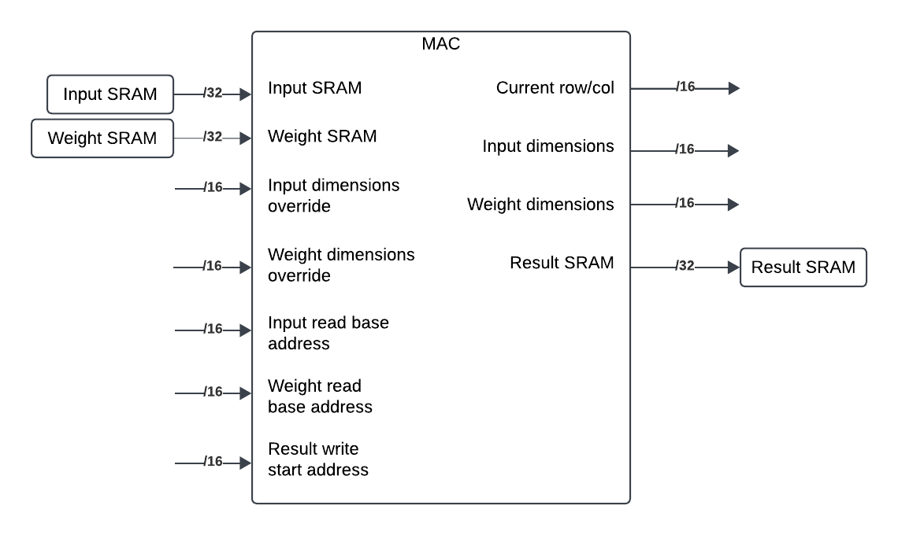

# ECE564 Final Project Report

## Abstract
The device described in `dut.sv` can be used as part of a transformer model used in NLP (natural language processing). Specifically, the hardware performs a scaled dot-product attention, which provides an NLP model self-attention capabilities. This module reads from 2 input SRAMs and performs several matrix multiplications and transpositions on both the input data and intermediate results to arrive at the scaled dot-product attention matrix. 

This module builds on an existing matrix multiplier module designed, which is now called `MyMAC`. `MyMAC` has been substantially modified to accomodate the specific requirements of this particular application. The design makes efficient use of a single scratchpad SRAM to store intermediate values and minimizes idle time during the calculation process. The lowest achievable clock period is 16.1ns. 

## 1. Introduction
The rise of ChatGPT and other NLPs have increased the demand for high throughput, on device compute capabilities to protect customer provacy and enable offline usage. As a result, it becomes necessary for high throughput matrix computation to be done in parallel in hardware. 

The module presented in this document performs the scaled dot-product attention operation, which is the part of an NLP core responsible for self attention. 

The presented module has the following features: 
### Standalone Matrix Multiplication Module
  - Pipelined read to minimize clock cycles used
  - Fault tolerant interlocking read address calculation
  - Robust design to handle edge cases such as 1x1 input matrices

### Self Attention Module
  - Parallel reads and writes to maximize throughput
  - Instant matrix transpose capabilities to avoid downtime

## 2. Micro-Architecture

The above diagram describes the overall architecture of the system. The MAC module is the core of the self attention module performing matrix multiplications. The MAC module's read ports for input, weight, scratchpad, and result SRAMs are multiplexed to allow the MAC to read and calculate using intermediate results stored in the results or scratchpad SRAM. 

A finite state machine is used to generate control signals, which controls the MAC input multiplexers and various aspects of the MAC module. The simplified state transition diagram is shown below: 

In each calculation state, the module configures the MAC to read and write from the correct SRAMs and correct addresses, then creates a start condition for the MAC module. It then waits for the MAC to complete its operations before moving into the next state. Once all calculations are done, the module will signal that the results are ready. 

The MAC module also operates as a finite state machine, with its simplified state transition diagram shown below: 

After a start condition, the MAC spends the majority of its time in the multiply-accumulate loop, writing the result after each row result element is complete. 

## 3. Interface Specification

The self-attention module has the following input and output signals: 

### Global Signals
| Signal Name | IO | Width | Purpose |
|-------------|----|-------|---------|
| `clk` | I | 1 | Clock signal, 16.1ns minimum clock period |
| `reset_n` | I | 1 | Synchronous reset | 

### Input SRAM Interface
| Signal Name | IO | Width | Purpose |
|-------------|----|-------|---------|
| `dut__tb__sram_input_read_address` | O | 16 | Read address control |
| `tb__dut__sram_input_read_data` | I | 32| Read data line | 

### Weight SRAM Interface
| Signal Name | IO | Width | Purpose |
|-------------|----|-------|---------|
| `dut__tb__sram_weight_read_address` | O | 16 | Read address control |
| `tb__dut__sram_weight_read_data` | I | 32| Read data line | 

### Result SRAM Interface
| Signal Name | IO | Width | Purpose |
|-------------|----|-------|---------|
| `dut__tb__sram_result_write_enable` | O | 1 | Write enable for result SRAM|
| `dut__tb__sram_result_write_address` | O | 16 | Write address for result SRAM | 
| `dut__tb__sram_result_write_data` | O | 32 | Write data for result SRAM | 
| `dut__tb__sram_result_read_address` | O | 16 | Read address control |
| `tb__dut__sram_result_read_data` | I | 32| Read data line |

**Note:** while a calculation is running, assume that the connected SRAMs are continuously used and do not attempt to read or write to them until after the calculation is complete. 

After ensuring that the SRAMs are connected to the module as desired, the following signals can be used to control and monitor the status of the module: 

### Control Signals
| Signal Name | IO | Width | Purpose |
|-------------|----|-------|---------|
| `dut_valid` | I | 1 | Assert start condition for the module |
| `dut_ready` | O | 1 | Asserted when calculations are complete | 

The handshake to begin calculations is shown below: 

**Note:** Do not assert `dut_valid` unless `dut_ready` is asserted. If `dut_ready` is low, that means the module is still performing the previous calculation. `dut_ready` will be asserted once all results have been written to the result SRAM.

## 4. Technical Implementation
### MAC Interfaces
The MAC used in this design has been modified with additional interfaces to facilitate the specific application. The simplified interface diagram is shown below: 

The additional interfaces enables the following: 
- The MAC can receive matrix dimension information from the added dimension lines, meaning that address `0` of the input and weight matrices do not need to contain the matrix dimensions. 
- The MAC also outputs the dimensions of the matrices it is currently reading (if the input SRAM provides that information), so driving modules can obtain these dimensions without querying the SRAM itself. 
- Read/write address override lines enables the MAC to start reading from arbitrary address in the input SRAMs and start writing results to an arbitrary target address in the result SRAM.
- The MAC outputs the current matrix row/col a result value is being written to, this is helpful for matrix transpose operations if necessary. 
  
Additionally, rather than simply using parallel counters for read address calculation during matrix multiplication, the MAC uses an interlocking address calculation mechanism, where reaching the end of a matrix column in one operand acts as a signal to trigger a row wraparound in the other operand, and vice versa. This robust system helps prevent synchronization errors that can be caused by clock noise injection or interrupts. 

### Self Attention Module
The self attention module uses the MAC module to complete multiple matrix multiplications in sequence in an efficient manner. The module has several key features that will be discussed in this section. The following diagram illustrates the calculations required:
 

**Note:** Even though multiplies are shown in this diagram, only one instance of the MAC module is used to minimize area. 

In order to perform these calculations in the most efficient manner possible, the following features are implemented. 

#### Multiplexed SRAM Interfaces for MAC
The module multiplexes the SRAM interfaces for the MAC module. This allows the module to: 
- Read from either the input SRAM or result SRAM at its input A
- Read from either the weight SRAM or scratchpad SRAM at its input B
- Write to both the result SRAM and scratchpad SRAM simultaneously

This feature allows all operations to be performed using only one scratchpad SRAM and removes the need for input SRAMs to support parallel reads. This also allows parallel writing of intermediate results to the scratchpad SRAM, eliminating the need to pause matrix calculations for intermediate results write and retrieval. In this design, during V and K result calculations, the results are automatically written to the scratchpad SRAM. 

Additionally, the V matrix needs to be transposed for the correct calculation of the Z matrix. The row/col output lines on the MAC module supports this by enabling a very simple transpose matrix address translation performed as purely combinational logic: 

`tranposed_addr = MAC_curr_col * num_rows + MAC_curr_row`

These mechanisms allows the transpose matrix to be stored in the scratchpad SRAM with no clock overhead. 

## 5. Verification

This module was tested with multiple input SRAM entries including edge cases that yield 1x1 intermediate matrices. 

## 6. Conclusions

The module allows fast and efficient calculation of the scaled dot product attention calculation. Several parallelization techniques are used to maximize the throughput of the system, and mechanisms are in place to ensure its robustness. The system can operate on a clock cycle of 16.1ns with an area of 9004um^2. 
